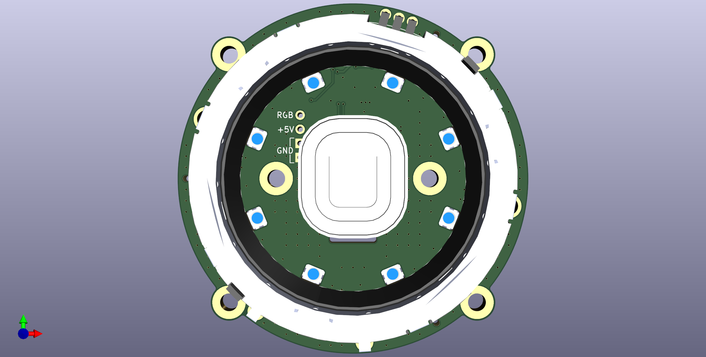
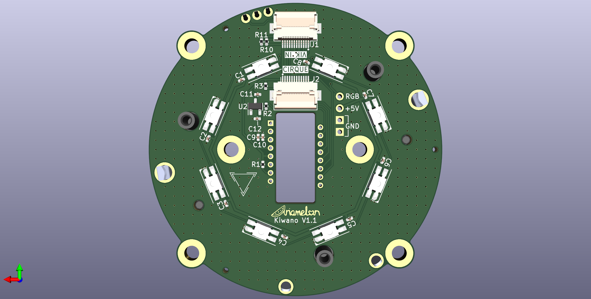

# Kiwano
Ring rotary encoder and PMW3360/Cirque [VIK](https://github.com/sadekbaroudi/vik) module with RGB backlight.

## Disclaimer
This board is licensed under CC BY 4.0.

## VIK module certification card

| Category                | Classification          | Response           |
| ----------------------- | ----------------------- | ------------------ |
| FPC connector           | Required                | :heavy_check_mark: |
| Breakout pins           | Recommended             | :x:                |
| Uses: SPI               | Optional                | :heavy_check_mark: |
| SPI used for SPI only   | Strongly recommended    | :heavy_check_mark: |
| Uses: I2C               | Optional                | :heavy_check_mark: |
| I2C used for I2C only   | Strongly Recommended    | :heavy_check_mark: |
| I2C pull ups            | Required                | :heavy_check_mark: |
| Uses: RGB               | Optional                | :heavy_check_mark: |
| Uses: Extra GPIO 1      | Optional                | :heavy_check_mark: |
| Uses: Extra GPIO 2      | Optional                | :heavy_check_mark: |
| Standard PCB Size/Mount | Strongly Recommended    | Large              |

## Changelog
* 29/07/2023: Added VIK size row to certification card.
* 28/07/2023: Initial commit.