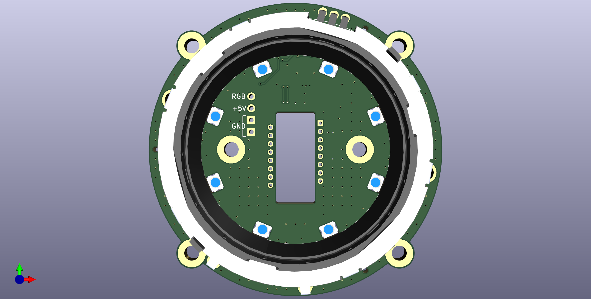

# Kiwano
Ring rotary encoder and PMW3360/Cirque [VIK](https://github.com/sadekbaroudi/vik) module with RGB backlight.

## Disclaimer
This board is licensed under CERN-OHL-S-2.0.

## Key Features
* PER56 rotary ring encoder.
* Illuminated RGB ring.
* Cirque trackpad support in the middle of the PER56.
* PMW3360 and 34mm trackball support in the middle of the PER56, utilizing 7.5mm BTUs (e.g. Veichu VCN310 7.5mm).
* Trackball has two styles: illuminated outer ring, and illuminated trackball.

## VIK module certification card

| Category                | Classification          | Response           |
| ----------------------- | ----------------------- | ------------------ |
| FPC connector           | Required                | :heavy_check_mark: |
| Breakout pins           | Recommended             | :x:                |
| Uses: SPI               | Optional                | :heavy_check_mark: |
| SPI used for SPI only   | Strongly recommended    | :heavy_check_mark: |
| Uses: I2C               | Optional                | :heavy_check_mark: |
| I2C used for I2C only   | Strongly Recommended    | :heavy_check_mark: |
| I2C pull ups            | Required                | :heavy_check_mark: |
| Uses: RGB               | Optional                | :heavy_check_mark: |
| Uses: Extra GPIO 1      | Optional                | :heavy_check_mark: |
| Uses: Extra GPIO 2      | Optional                | :heavy_check_mark: |
| Standard PCB Size/Mount | Strongly Recommended    | Large              |

## Changelog
* 22/10/2024: CERN-OHL-S-2.0 license added.
* 14/10/2023: V1.1 update. Changed LDO to XC6206P202MR. Removed RC filter and pullup from encoder pins.
* 18/09/2023: Fixed .gitignore file. Increased tolerances of PER-56 base mount.
* 28/08/2023: Unified component libraries into one big library. Fixed 3DP files.
* 04/08/2023: Updated SK6812 MINI-E and switch footprints. Changed VIK FFC to FH12. Stitched ground planes together. Fixed VIK footprint. Moved production files to easier to access location.
* 02/08/2023: Fixed 3DP files.
* 01/08/2023: Files for trackpad mount and knob moved here from [Honeydew](https://github.com/Ariamelon/Honeydew/). Added trackball mount STEP files, using 7.5mm BTUs.
* 30/07/2023: Updated BOM.
* 29/07/2023: Added VIK size row to certification card.
* 28/07/2023: Initial commit.